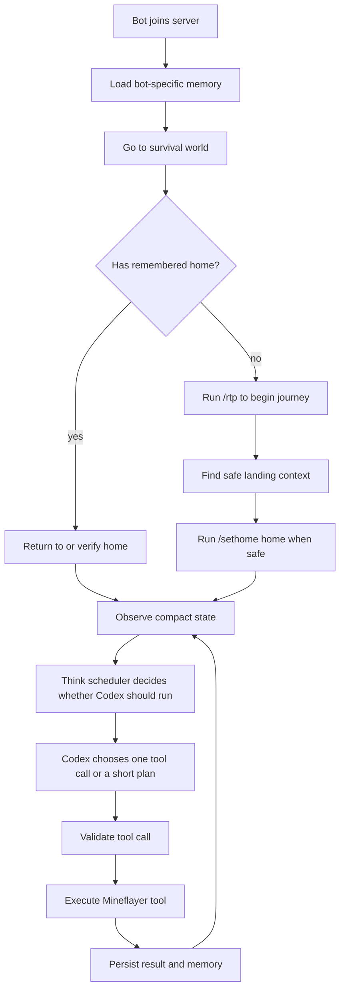
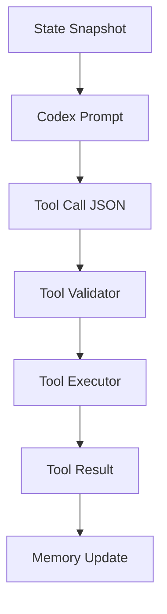

# AI NPC Brain And Tools Design

## Purpose

The bot should stop behaving like a menu-driven Minecraft helper. The new model is an AI NPC whose brain is Codex CLI using a GPT model. Mineflayer provides safe tools, memory, and world state. The model chooses the next action through tool calls.

This replaces `/automation` as the primary behavior path. Existing automation modules can remain as legacy/manual code for now, but the AI NPC should not depend on players selecting automation menus.

## Core Flow



`/rtp` is only a fresh-life bootstrap action. Once the bot has a remembered and verified home, home becomes the anchor of the NPC's life. The bot should return to home for storage, rest, safety, crafting, cooking, project continuation, and reflection.

## Thinking Strategy

Use a hybrid scheduler:

- Major events are the main trigger.
- Tool completion triggers short continuation thoughts.
- A slow idle loop preserves lifestyle continuity.
- Reflex rules handle obvious survival cases without spending tokens.
- Deep reflection writes a journal every 30 real minutes.

This avoids a wasteful constant thinking loop while still making the NPC feel alive.

## Think Types

### Urgent Event Think

Runs immediately for dangerous or highly relevant changes:

- attacked
- low health
- low food with no active food action
- stuck
- death or respawn
- night and exposed
- drowning, lava, falling, nearby hostile mob
- player directly interacts with or messages the bot
- tool failure that blocks the current goal

The prompt should be small and action-oriented. It should ask for one safe tool call.

### Tool Continuation Think

Runs after a tool finishes or fails when the current task still needs another decision.

Examples:

- `craft_item` succeeded, now decide whether to place the item or craft another.
- `go_to_position` failed, decide whether to retry, choose another target, or abandon the task.
- `smelt_item` started, decide whether to wait, gather fuel, or inspect inventory.

This should receive the previous tool call, result, current goal, and compact state delta.

### Slow Idle Think

Runs only when safe and idle, roughly every 5 to 15 real minutes.

It should be skipped when:

- a tool is active
- the bot is in combat or unsafe
- no meaningful state changed since the last thought
- another high-priority thought happened recently

Purpose:

- continue long-term projects
- decide a new small goal
- maintain personality continuity
- avoid the bot feeling frozen when nothing dramatic happens

### Deep Reflection And Journal

Runs every 30 real minutes, not every Minecraft day.

Purpose:

- summarize recent events
- compress memory
- update lifestyle and self-image
- record project progress
- avoid repeatedly sending long history to Codex

Deep reflection should not directly perform world actions. It writes memory and may update goals.

## Token Efficiency Rules

Before calling Codex, a local scheduler should ask:

- Is the bot safe?
- Is a tool already running?
- Did anything meaningful change?
- Is this event high priority?
- Did we call Codex too recently for the same reason?
- Can a local reflex solve this without the model?

The Codex prompt should include compact state, not raw world dumps.

Good compact state:

```json
{
  "reason": "tool_done",
  "currentGoal": "Build a starter shelter",
  "lastTool": {
    "name": "craft_item",
    "ok": true,
    "item": "crafting_table"
  },
  "inventory": ["oak_log x12", "stick x4", "crafting_table x1"],
  "time": "day",
  "danger": "none",
  "nearbyUsefulBlocks": ["oak_log", "grass_block"],
  "knownPlaces": ["home"],
  "problem": "Need to place crafting table and craft door"
}
```

Bad state:

```text
Full logs, full memory, every nearby block, every raw entity, and unfiltered chat history.
```

## Local Reflexes

These should run without Codex when possible:

- eat available food when hungry
- retreat from lava, drowning, or immediate mob threat
- stop movement when stuck or falling
- skip thinking while an existing tool is active
- avoid duplicate thoughts when state has not changed
- record simple events to memory

Reflexes are not the NPC brain. They are safety and token-saving instincts.

## Tool-First Architecture

Codex should not directly manipulate Mineflayer objects. It should return validated JSON tool calls.



Tool call shape:

```json
{
  "tool": "craft_item",
  "args": {
    "item": "crafting_table",
    "count": 1
  },
  "reason": "I need a crafting table to start building a shelter."
}
```

The runtime validates:

- tool name is allowlisted
- arguments are safe and bounded
- command is allowed
- movement/building action is not destructive beyond policy
- bot is in a valid state for the tool

If Codex asks for a tool that does not exist, or if it describes an action that the current tool registry cannot perform, the runtime should record that missing capability instead of silently failing. This is part of the NPC's self-improvement loop.

## Missing Capability Backlog

The NPC should be able to notice the gap between what it wants to do and what it can currently do. For example, if its goal is to upgrade gear but it has no mining tool interface, it should record a missing mining capability so future development can add the tool.

Missing capability records should answer:

- What goal was blocked?
- What action did the NPC want to take?
- Which tool or capability was missing?
- Why did the NPC believe it needed that capability?
- What state made the need visible?
- How often has this same need appeared?
- How important is it to the NPC's life goals?

Recommended record shape:

```json
{
  "id": "mine_ore-for-gear-upgrade",
  "status": "open",
  "capability": "mine ore safely",
  "desiredTool": "mine_block_or_vein",
  "blockedGoal": "Upgrade from stone tools to iron gear.",
  "reason": "The NPC needs iron ore but has no safe mining tool.",
  "context": {
    "location": "near home",
    "inventory": ["stone_pickaxe", "torch"],
    "knownNeed": "iron ingots"
  },
  "priority": "high",
  "count": 3,
  "firstSeenAt": 1765000000000,
  "lastSeenAt": 1765003600000,
  "suggestedInputs": ["blockType", "maxDistance", "safetyPolicy"],
  "suggestedResult": "mined block count, collected items, danger encountered"
}
```

There should be two views of this backlog:

- **Per-bot backlog:** What this specific NPC has learned it needs, stored in that bot's memory root.
- **Shared developer backlog:** Deduped missing tools across all bots, used by the human developer to decide what to implement next.

The existing missing-function recorder can inspire the first implementation, but this new backlog should be structured data rather than only markdown. Markdown can still be generated as a human-readable report.

### Missing Capability Flow

When a capability is missing:

1. Codex proposes a tool call or action intent.
2. The validator cannot match it to an allowlisted tool.
3. The runtime records a missing capability event.
4. The per-bot `missing-tools.json` entry is created or updated.
5. A shared backlog entry is created or updated.
6. The tool result tells Codex that the capability is not available yet.
7. Codex chooses a fallback action, such as preparing resources it can gather, returning home, journaling the need, or switching to a different goal.

Repeated requests should update `count`, `lastSeenAt`, recent examples, and priority rather than creating endless duplicates. Deduplication should use normalized capability name, desired tool name, and blocked goal.

Example fallback:

```json
{
  "tool": "record_missing_tool",
  "args": {
    "capability": "mine ore safely",
    "desiredTool": "mine_block_or_vein",
    "blockedGoal": "Upgrade gear",
    "reason": "I need iron but cannot mine or navigate caves yet."
  },
  "reason": "I should remember this missing ability so my toolset can improve later."
}
```

## Initial Tool Categories

### World And Observation

- `observe_world`
- `scan_blocks`
- `scan_entities`
- `inspect_time`
- `inspect_health`
- `inspect_inventory`
- `remember_place`
- `read_known_places`

### Server Commands

- `run_safe_command`
- `go_survival`
- `rtp`
- `set_home`
- `go_home`

Allowed examples:

- `/survival`
- `/rtp`
- `/sethome home`
- `/home home`
- `/spawn`

Blocked examples:

- economy transfer commands
- moderation commands
- permission commands
- destructive home deletion commands unless explicitly designed later
- server-mode switching commands outside survival flow

### Movement

- `go_to_position`
- `go_to_block`
- `return_home`
- `follow_player`
- `stop_movement`

### Inventory And Containers

- `deposit_items`
- `withdraw_items`
- `remember_container`
- `find_container`
- `equip_item`
- `drop_item` with strict safety rules

### Crafting

- `list_craftable_items`
- `craft_item`
- `plan_crafting_ingredients`

### Building

- `place_block`
- `dig_block`
- `build_small_shelter`
- `light_area`
- `repair_shelter`

Building tools should start conservative. The first milestone should avoid large free-form building and focus on small shelters, torches, doors, and simple utility blocks.

### Cooking And Smelting

- `place_furnace`
- `find_furnace`
- `smelt_item`
- `cook_food`
- `collect_furnace_output`

### Survival

- `eat_food`
- `sleep_if_possible`
- `retreat_to_safe_place`
- `avoid_hostile_mobs`

### Memory

- `read_memory_summary`
- `write_memory_event`
- `record_missing_tool`
- `read_missing_tools`
- `remember_project`
- `update_project`
- `write_journal_reflection`
- `update_lifestyle`

## Per-Bot Memory

Each bot needs its own memory root. Shared files such as `logs/container-memory.txt`, `logs/bot-debug.log`, `logs/places.txt`, and `logs/pyrofarm-memory.txt` should move behind per-bot path resolution.

Recommended layout:

```text
data/bots/<bot-id>/
  npc-life.json
  places.json
  containers.json
  projects.json
  players.json
  crafting.json
  building.json
  cooking.json
  missing-tools.json
  memory-summary.json
  event-log.jsonl
  daily-journal.md
  debug.log
```

`<bot-id>` should come from the local profile id when available. If no profile id exists, use a sanitized username.

Memory rules:

- Do not share life memory between bots.
- Do not send full memory to Codex.
- Send summaries and current relevant records only.
- Deep reflection compresses recent events every 30 real minutes.
- Memory write failures are advisory; the bot should continue.

### Home Memory

Home is first-class memory, not just a command shortcut.

The bot should store:

- home name, normally `home`
- dimension
- approximate position if known
- when it was set or last verified
- nearby useful blocks
- remembered containers at home
- active home projects
- safety notes such as lighting, doors, bed, food supply, and furnace availability

Startup behavior depends on this memory:

- If home memory exists and is recent enough, do not run `/rtp`.
- If home memory exists but has not been verified this session, use `/home home` or another safe verification path.
- If home verification fails, mark home as uncertain and ask Codex whether to retry, search, or start a new journey.
- If no home exists, use `/rtp`, find a safe place, and run `/sethome home`.

### Memory Layers

Memory should be layered so token usage stays bounded:

1. **Working memory:** The last few tool results and immediate state changes. This is small and can be included in the next prompt.
2. **Recent event log:** Append-only JSONL records such as tool calls, discoveries, danger, item storage, crafting, and player interactions.
3. **Structured long-term memory:** Compact JSON files for places, containers, players, projects, crafting, building, cooking, and NPC life.
4. **Summary memory:** A compact, model-readable summary of what matters now.
5. **Journal:** Human-readable reflections every 30 real minutes.

Only working memory, relevant structured records, and the current summary should go into normal Codex prompts.

Missing tools belong to structured memory. Normal prompts should include only the top relevant open missing tools, such as the top 3 items related to the current goal. Full missing-tool history should stay out of the prompt.

### Memory Compression

Memory compression runs during deep reflection every 30 real minutes and may also run when event logs exceed size limits.

The compression job should:

- read recent events since the last compression
- group events by topic: home, inventory, players, places, projects, danger, tools
- update structured memory files
- update `memory-summary.json`
- append a short entry to `daily-journal.md`
- mark compressed event offsets so old raw events do not need to be sent again
- merge duplicate missing-tool records and raise priority for repeated blockers

Prompt memory should have hard budgets:

- current state: small snapshot only
- working memory: last 3 to 8 important events
- summary memory: short bullet summary
- structured records: only records relevant to the current goal
- raw event log: never sent wholesale

Example `memory-summary.json`:

```json
{
  "updatedAt": 1765000000000,
  "identity": "A cautious homesteader trying to build a safe forest home.",
  "home": "Home is set in a forest. It has one chest, a crafting table, and needs more lighting.",
  "currentProjects": [
    "Improve shelter",
    "Build food supply"
  ],
  "knownRisks": [
    "Night near home is unsafe because lighting is incomplete."
  ],
  "importantMissingTools": [
    "Needs a safe mining tool to gather iron for gear upgrades."
  ],
  "recentImportantEvents": [
    "Set home after /rtp.",
    "Stored oak logs in home chest.",
    "Started shelter project."
  ]
}
```

This summary is what Codex usually sees. The raw journal and event log are for compression and debugging, not normal thinking.

## Startup Behavior

On first spawn:

1. Load per-bot memory.
2. Enter survival world.
3. Check home memory.
4. If home exists, verify or return to home and skip `/rtp`.
5. If no home exists, run `/rtp`.
6. After `/rtp`, observe landing area.
7. If safe and no home exists, run `/sethome home`.
8. Trigger an urgent/event thought with reason `spawn_home_verified` or `spawn_wilderness_start`.
9. Codex chooses the first tool call for the current context.

Expected first goals:

- secure food
- gather basic wood
- make crafting table
- make starter shelter
- light area
- remember home

## Relationship To Existing Automations

Existing automation modules should not be the AI NPC's main behavior model.

Options:

- Keep them as manual legacy commands temporarily.
- Wrap useful primitives as tools.
- Retire menu-based `/automation` once tool coverage is good enough.

The LLM should not choose "start Farming automation" as the main action long term. It should choose smaller grounded tools such as scan, move, harvest, craft, cook, place, and store.

## First Milestone

Build the new architecture in a narrow, testable slice:

- per-bot memory path resolver
- think scheduler with event, continuation, idle, reflection triggers
- startup home/wilderness flow: survival, verify existing home or use `/rtp` only when no home exists, then `/sethome home`
- Codex brain prompt for one tool call
- tool registry and validator
- initial tools:
  - `observe_world`
  - `run_safe_command`
  - `rtp`
  - `set_home`
  - `inspect_inventory`
  - `remember_place`
  - `write_memory_event`
  - `record_missing_tool`
  - `read_missing_tools`
- no full crafting/building/cooking yet; define their interfaces for later milestones

## Later Milestones

1. Add movement and block interaction tools.
2. Add crafting tools.
3. Add cooking and smelting tools.
4. Add simple building tools.
5. Add project memory.
6. Generate a human-readable missing-tool report from the structured backlog.
7. Retire automation menu from NPC flow.

## Acceptance Criteria

- Bot no longer requires `/automation` for AI NPC behavior.
- Bot joins, enters survival, verifies existing home when available, and only runs `/rtp` when no home exists.
- Bot can set `/sethome home` through a safe tool after a fresh wilderness start.
- Codex is called through a scheduler that prefers major events and tool continuation over frequent idle thinking.
- Idle thinking is rate-limited.
- Deep reflection runs every 30 real minutes.
- Memory compression prevents prompt growth by sending summaries and relevant records instead of full history.
- Tool calls are allowlisted and validated.
- Missing or unavailable capabilities are recorded as structured backlog items.
- Repeated missing capability requests are deduped and prioritized.
- Codex receives a clear failure result and chooses a fallback action when a desired tool does not exist.
- Each bot reads/writes its own memory files.
- Existing random five-minute automation behavior does not return.
