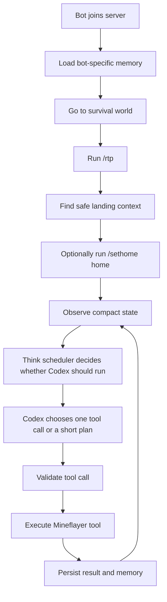
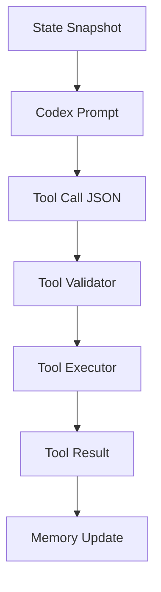

# AI NPC Brain And Tools Design

## Purpose

The bot should stop behaving like a menu-driven Minecraft helper. The new model is an AI NPC whose brain is Codex CLI using a GPT model. Mineflayer provides safe tools, memory, and world state. The model chooses the next action through tool calls.

This replaces `/automation` as the primary behavior path. Existing automation modules can remain as legacy/manual code for now, but the AI NPC should not depend on players selecting automation menus.

## Core Flow



## Thinking Strategy

Use a hybrid scheduler:

- Major events are the main trigger.
- Tool completion triggers short continuation thoughts.
- A slow idle loop preserves lifestyle continuity.
- Reflex rules handle obvious survival cases without spending tokens.
- Deep reflection writes a journal every 30 real minutes.

This avoids a wasteful constant thinking loop while still making the NPC feel alive.

## Think Types

### Urgent Event Think

Runs immediately for dangerous or highly relevant changes:

- attacked
- low health
- low food with no active food action
- stuck
- death or respawn
- night and exposed
- drowning, lava, falling, nearby hostile mob
- player directly interacts with or messages the bot
- tool failure that blocks the current goal

The prompt should be small and action-oriented. It should ask for one safe tool call.

### Tool Continuation Think

Runs after a tool finishes or fails when the current task still needs another decision.

Examples:

- `craft_item` succeeded, now decide whether to place the item or craft another.
- `go_to_position` failed, decide whether to retry, choose another target, or abandon the task.
- `smelt_item` started, decide whether to wait, gather fuel, or inspect inventory.

This should receive the previous tool call, result, current goal, and compact state delta.

### Slow Idle Think

Runs only when safe and idle, roughly every 5 to 15 real minutes.

It should be skipped when:

- a tool is active
- the bot is in combat or unsafe
- no meaningful state changed since the last thought
- another high-priority thought happened recently

Purpose:

- continue long-term projects
- decide a new small goal
- maintain personality continuity
- avoid the bot feeling frozen when nothing dramatic happens

### Deep Reflection And Journal

Runs every 30 real minutes, not every Minecraft day.

Purpose:

- summarize recent events
- compress memory
- update lifestyle and self-image
- record project progress
- avoid repeatedly sending long history to Codex

Deep reflection should not directly perform world actions. It writes memory and may update goals.

## Token Efficiency Rules

Before calling Codex, a local scheduler should ask:

- Is the bot safe?
- Is a tool already running?
- Did anything meaningful change?
- Is this event high priority?
- Did we call Codex too recently for the same reason?
- Can a local reflex solve this without the model?

The Codex prompt should include compact state, not raw world dumps.

Good compact state:

```json
{
  "reason": "tool_done",
  "currentGoal": "Build a starter shelter",
  "lastTool": {
    "name": "craft_item",
    "ok": true,
    "item": "crafting_table"
  },
  "inventory": ["oak_log x12", "stick x4", "crafting_table x1"],
  "time": "day",
  "danger": "none",
  "nearbyUsefulBlocks": ["oak_log", "grass_block"],
  "knownPlaces": ["home"],
  "problem": "Need to place crafting table and craft door"
}
```

Bad state:

```text
Full logs, full memory, every nearby block, every raw entity, and unfiltered chat history.
```

## Local Reflexes

These should run without Codex when possible:

- eat available food when hungry
- retreat from lava, drowning, or immediate mob threat
- stop movement when stuck or falling
- skip thinking while an existing tool is active
- avoid duplicate thoughts when state has not changed
- record simple events to memory

Reflexes are not the NPC brain. They are safety and token-saving instincts.

## Tool-First Architecture

Codex should not directly manipulate Mineflayer objects. It should return validated JSON tool calls.



Tool call shape:

```json
{
  "tool": "craft_item",
  "args": {
    "item": "crafting_table",
    "count": 1
  },
  "reason": "I need a crafting table to start building a shelter."
}
```

The runtime validates:

- tool name is allowlisted
- arguments are safe and bounded
- command is allowed
- movement/building action is not destructive beyond policy
- bot is in a valid state for the tool

## Initial Tool Categories

### World And Observation

- `observe_world`
- `scan_blocks`
- `scan_entities`
- `inspect_time`
- `inspect_health`
- `inspect_inventory`
- `remember_place`
- `read_known_places`

### Server Commands

- `run_safe_command`
- `go_survival`
- `rtp`
- `set_home`
- `go_home`

Allowed examples:

- `/survival`
- `/rtp`
- `/sethome home`
- `/home home`
- `/spawn`

Blocked examples:

- economy transfer commands
- moderation commands
- permission commands
- destructive home deletion commands unless explicitly designed later
- server-mode switching commands outside survival flow

### Movement

- `go_to_position`
- `go_to_block`
- `return_home`
- `follow_player`
- `stop_movement`

### Inventory And Containers

- `deposit_items`
- `withdraw_items`
- `remember_container`
- `find_container`
- `equip_item`
- `drop_item` with strict safety rules

### Crafting

- `list_craftable_items`
- `craft_item`
- `plan_crafting_ingredients`

### Building

- `place_block`
- `dig_block`
- `build_small_shelter`
- `light_area`
- `repair_shelter`

Building tools should start conservative. The first milestone should avoid large free-form building and focus on small shelters, torches, doors, and simple utility blocks.

### Cooking And Smelting

- `place_furnace`
- `find_furnace`
- `smelt_item`
- `cook_food`
- `collect_furnace_output`

### Survival

- `eat_food`
- `sleep_if_possible`
- `retreat_to_safe_place`
- `avoid_hostile_mobs`

### Memory

- `read_memory_summary`
- `write_memory_event`
- `remember_project`
- `update_project`
- `write_journal_reflection`
- `update_lifestyle`

## Per-Bot Memory

Each bot needs its own memory root. Shared files such as `logs/container-memory.txt`, `logs/bot-debug.log`, `logs/places.txt`, and `logs/pyrofarm-memory.txt` should move behind per-bot path resolution.

Recommended layout:

```text
data/bots/<bot-id>/
  npc-life.json
  places.json
  containers.json
  projects.json
  players.json
  crafting.json
  building.json
  cooking.json
  daily-journal.md
  debug.log
```

`<bot-id>` should come from the local profile id when available. If no profile id exists, use a sanitized username.

Memory rules:

- Do not share life memory between bots.
- Do not send full memory to Codex.
- Send summaries and current relevant records only.
- Deep reflection compresses recent events every 30 real minutes.
- Memory write failures are advisory; the bot should continue.

## Startup Behavior

On first spawn:

1. Load per-bot memory.
2. Enter survival world.
3. Run `/rtp`.
4. Observe landing area.
5. If safe and no home exists, run `/sethome home`.
6. Trigger an urgent/event thought with reason `spawn_wilderness_start`.
7. Codex chooses the first tool call for survival setup.

Expected first goals:

- secure food
- gather basic wood
- make crafting table
- make starter shelter
- light area
- remember home

## Relationship To Existing Automations

Existing automation modules should not be the AI NPC's main behavior model.

Options:

- Keep them as manual legacy commands temporarily.
- Wrap useful primitives as tools.
- Retire menu-based `/automation` once tool coverage is good enough.

The LLM should not choose "start Farming automation" as the main action long term. It should choose smaller grounded tools such as scan, move, harvest, craft, cook, place, and store.

## First Milestone

Build the new architecture in a narrow, testable slice:

- per-bot memory path resolver
- think scheduler with event, continuation, idle, reflection triggers
- startup wilderness flow: survival, `/rtp`, optional `/sethome home`
- Codex brain prompt for one tool call
- tool registry and validator
- initial tools:
  - `observe_world`
  - `run_safe_command`
  - `rtp`
  - `set_home`
  - `inspect_inventory`
  - `remember_place`
  - `write_memory_event`
- no full crafting/building/cooking yet; define their interfaces for later milestones

## Later Milestones

1. Add movement and block interaction tools.
2. Add crafting tools.
3. Add cooking and smelting tools.
4. Add simple building tools.
5. Add project memory.
6. Retire automation menu from NPC flow.

## Acceptance Criteria

- Bot no longer requires `/automation` for AI NPC behavior.
- Bot joins, enters survival, runs `/rtp`, and can set home through a safe tool.
- Codex is called through a scheduler that prefers major events and tool continuation over frequent idle thinking.
- Idle thinking is rate-limited.
- Deep reflection runs every 30 real minutes.
- Tool calls are allowlisted and validated.
- Each bot reads/writes its own memory files.
- Existing random five-minute automation behavior does not return.
